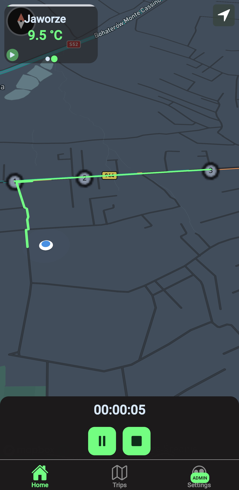
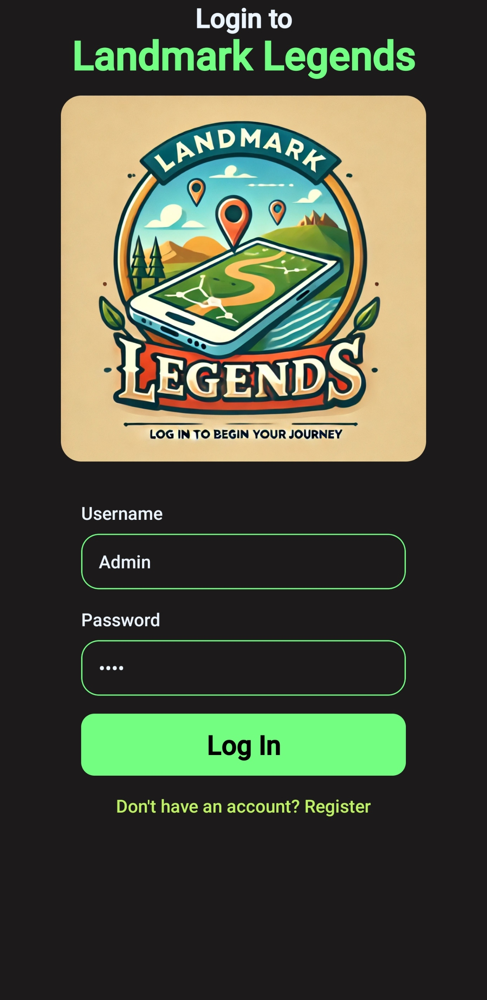
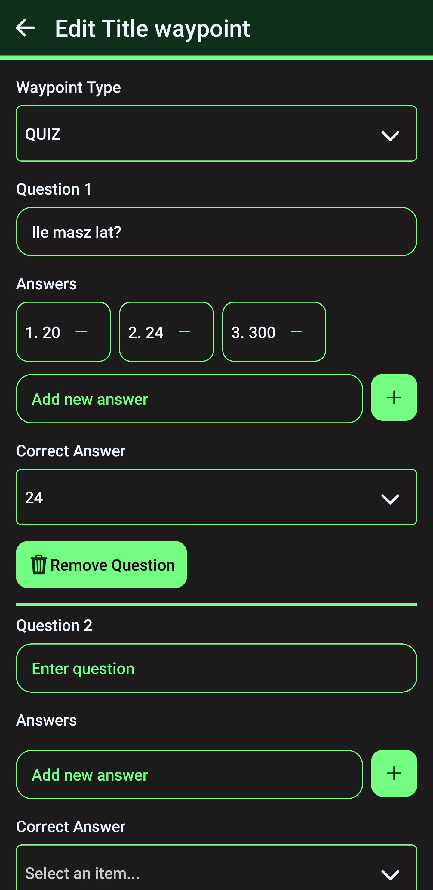
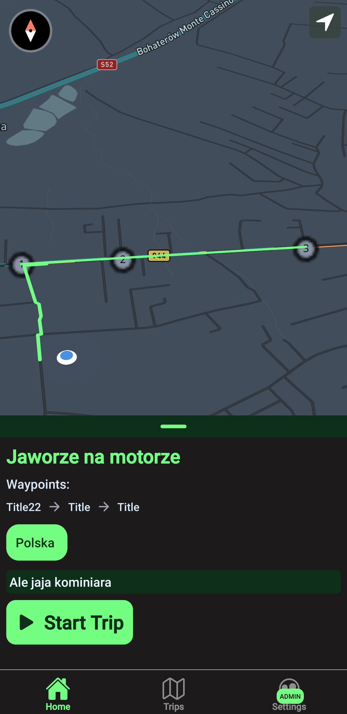
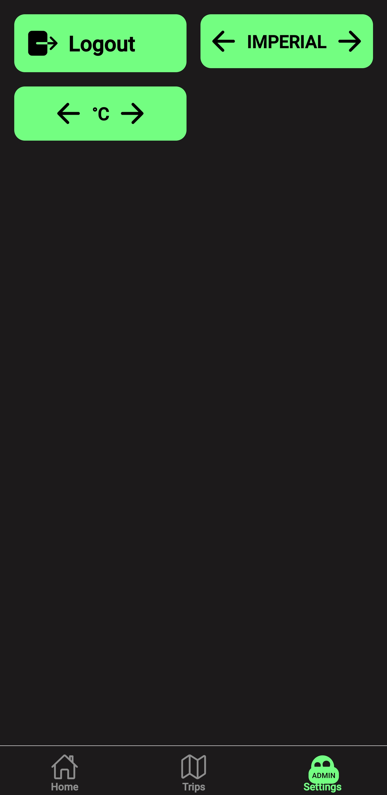
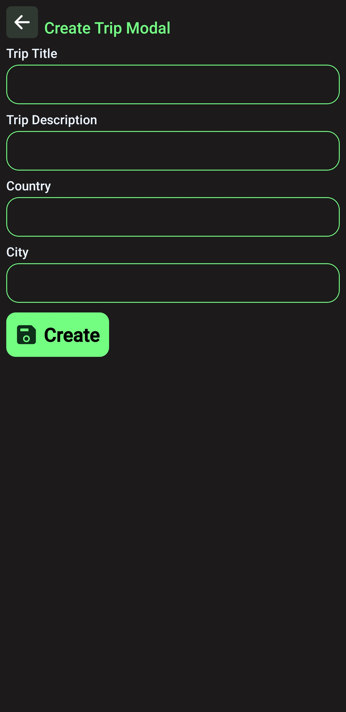

# Terrain Game Mobile App

# (Project is still in development)

Terrain game is a mobile application built with React Native and Expo that helps users navigate and explore their surroundings. The app provides features like map navigation, directions, and weather information by integrating various APIs. You can create waypoints and quizes.



## Features

- Interactive maps powered by Mapbox
- Turn-by-turn directions
- Real-time weather information
- User-friendly interface

## Technology Stack

### Frontend
- React Native
- Expo
- TypeScript

### Backend
- Node.js
- TypeScript
- CQRS architecture

### APIs
- Mapbox for map rendering `https://console.mapbox.com/account/access-tokens/`
- Mapbox Directions API for navigation `https://console.mapbox.com/account/access-tokens/`
- Weather API for forecast information `https://openweathermap.org/city/2643743`

## Getting Started

### Prerequisites

- Node.js (v16 or higher)
- npm or yarn
- Expo CLI
- Android Studio or Xcode (for mobile development)

### Installation

1. Clone the repository:
```bash
git clone https://github.com/GenWatt/TerrainGames.git
cd TerrainGames
```

2. Install dependencies:
```bash
# Install server dependencies
cd server
npm install

# Install mobile app dependencies
cd ../front
npm install
```

3. Environment setup:
   
Create a .env file based on the provided .env.sample in server and front folder:

## Running the Application

### Server
```bash
cd server
npm run dev
```

### Mobile App
```bash
cd front
npx expo prebuild
npm run android
```

You can't use expo go as app relies on native modules (mapbox). You need to create admin goingt to `/auth/admin`

Creadentials:
- Username: Adminek
- Password: 1234

## Screenshots








## Giuthub Actions

`Server-build.yml` - This action builds the server and deploys it to `render.com`.
`expo-build.yml` - This action builds the mobile app and deploys it to `expo.dev`.
To make it work you need to create `EXPO_TOKEN` and `RENDER_DEPLOY_HOOK` secrets in your repository settings.